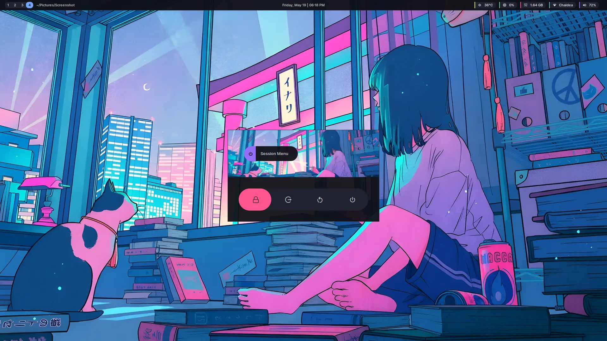

<p align="center">

<br/><br/>
<b>~/.nullxception-dotfiles</b>
<br/><br/>


</p>

<br/>

This repo contains configurations that commonly used by me for my desktop and server.<br/>
The main reason was to helps me config my fresh machine faster, but also act as an archive in case someones want to know my setup.

# Installation

This dotfiles is grouped by module or package, you can just run [./dot.sh](dot.sh) followed by the package path.

```bash
./dot.sh <package>
```

for example, installing waybar and gtklock config

```bash
./dot.sh waybar gtklock
```

## About [./dot.sh](dot.sh)

[./dot.sh](dot.sh) is basically just a helper script to copy dotfiles's package.

Unlike GNU stow which populate a symlink, [./dot.sh](dot.sh) copy the actual files into defined target directory (at package's `.install`), so there's no need to keep the dotfiles repo for things to be functional.

Each package has `.install` file that will be sourced by [./dot.sh](dot.sh).
For complete example, take a look at [.install.example](.install.example).

# Gallery

| hyprland - [README.md](hypr/README.md)          |
| ----------------------------------------------- |
|  |

| firefox - [README.md](firefox/README.md) |
| ---------------------------------------- |
|   |

| rofi session menu                                      |
| ------------------------------------------------------ |
|  |

| gtklock                                 |
| --------------------------------------- |
|  |

# license

This dots is licensed under [BSD 3-Clause License](LICENSE).
