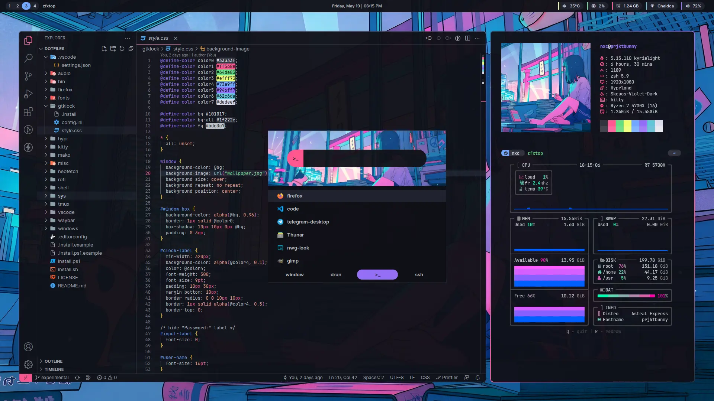
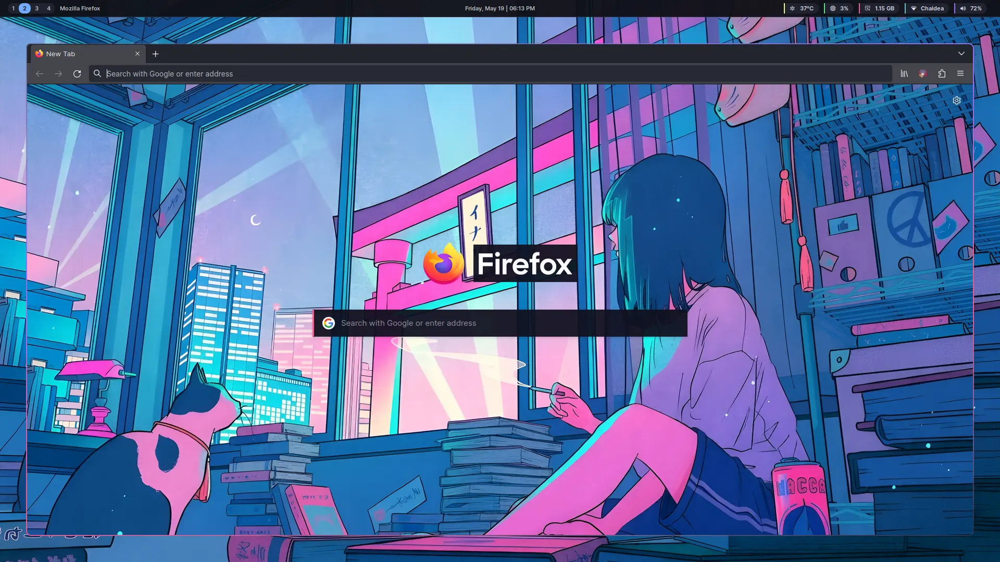

<p align="center">

<br/><br/>
<b>~/.nullxception-dotfiles</b>
<br/><br/>


</p>

<br/>

This repo contains set of some configurations that commonly used by me for my desktop or server.<br/>
The main reason was to helps me config my fresh machine faster, but also act as an archive in case someones want to know my setup.

So, don't be shy, give it a ⭐️ if some configs can helps you somehow :)

# Installation

This dotfiles is grouped by module or package, you can just run [./dot.sh](dot.sh) followed by the package path.

```bash
./dot.sh <package>
```

for example, installing waybar and gtklock config

```bash
./dot.sh waybar gtklock
```

> **Disclaimer** ⚠️<br/>
> For things like [sys/hw](sys/hw) or [sys/systemd](sys/systemd), I suggest you to not install it directly since it's a system-wide configuration.

## About [./dot.sh](dot.sh)

[./dot.sh](dot.sh) is basically just a helper script to copy dotfiles's module.

Unlike GNU stow which populate a symlink, [./dot.sh](dot.sh) copy the actual files into defined target directory (at module's `.install`), so there's no need to keep the dotfiles repo for things to be functional.

Each module has `.install` file that will be sourced by [./dot.sh](dot.sh).
For complete example, take a look at [.install.example](.install.example).

# Gallery

| hyprland setup                                  |
| ----------------------------------------------- |
|  |

| firefox w/  and [Cherry Midnight](https://addons.mozilla.org/en-US/firefox/addon/cherry-midnight) theme |
| ------------------------------------------------------------------------------------------------------------------------------ |
|                                                                                         |

| rofi session menu                                          |
| ---------------------------------------------------------- |
|  |

| gtklock                                 |
| --------------------------------------- |
|  |

# license

This dots is licensed under [BSD 3-Clause License](LICENSE).
